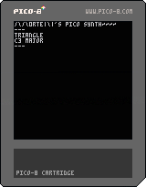

# pico8-synth

A small pico-8 synthesizer.

## Inspiration

Inspired by the [Makey Makey](https://makeymakey.com/).

## Interact

- Set scale, root note, instrument in menu (Enter)
- Notes: 
	- Left: 1st note
	- Right: 2nd note
	- Up: 3rd note
	- Down 4th note
	- 'c' 5th note
	- 'x' 6th note

## Todo

- Add support for second controller
- Waveform visualizer!